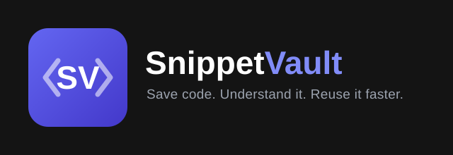

# Save code. Understand it. Reuse it faster.

A full-stack code snippet manager. Users sign in, then create, organize, version, annotate, and publicly share code snippets.

**Live at:** [snippetvault.me](https://snippetvault.me)

Monorepo with two independently deployed apps: `backend/` (Express API) and `frontend/` (React SPA).

MIT License - see [LICENSE](https://github.com/Zlatanoski/snippetvault/blob/stable/LICENSE) for details.

## Docker

For both modes, generate `POSTGRES_PASSWORD` with at least 32 cryptographically random characters from the URL-safe set `A-Z`, `a-z`, `0-9`, `_`, and `-`. The future installer must use the same character set without reducing password length or randomness because Compose places the password directly in `DATABASE_URL`.

### Local development

Create a root `.env` containing `POSTGRES_PASSWORD`, `BETTER_AUTH_SECRET`, `RESEND_API_KEY`, and `EMAIL_FROM`. Leave `CLIENT_URL` and `BETTER_AUTH_URL` unset to use the `http://localhost:8080` defaults, then run:

```bash
docker compose up --build
```

Open `http://localhost:8080`.

### Self-hosting with HTTPS

Copy `.env.selfhost.example` to the root `.env`, replace every required value, and set `DOMAIN`, `CLIENT_URL`, and `BETTER_AUTH_URL` to your public hostname and HTTPS URL. This self-host configuration is an alternative to the local configuration; do not reuse it unchanged with the localhost Compose stack.

Before starting, create an A and/or AAAA DNS record pointing the hostname to your server's public IP, allow inbound TCP ports 80 and 443 through every firewall, and ensure no other service occupies those ports.

```text
vault.example.com -> DNS A/AAAA -> server public IP -> Caddy :80/:443
```

Start the internet-facing stack with:

```bash
docker compose -f docker-compose.selfhost.yml up -d --build
```

Caddy obtains and renews the TLS certificate automatically once DNS and inbound connectivity are correct.
